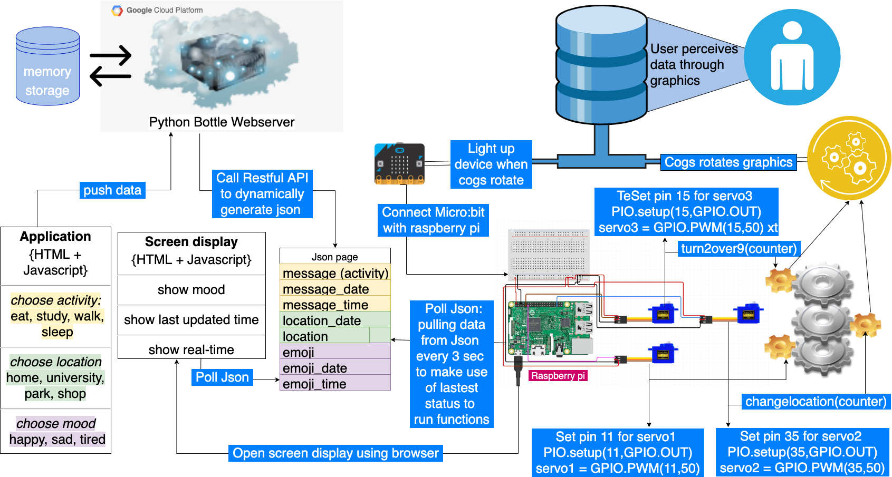

# techHCI
This set of code is for executing the full function of the physical prototype of LinkUS.

## Description and Functionality of Prototypes
1. app.py is a python script that provides RESTFUL API for push and pull data in JSON format. It also works as a webserver to serve both the webpage on http://35.201.182.206/ and http://35.201.182.206/emoji. Any Linux server with public IP address and with Python3 installed can run this script.
2. rotate.py is a script to be run on the Raspberry Pi to function the rotation of the cylindrical disks of the physical prototype. It contains an infinite loop to pull JSON every 3 seconds.
3. home.tpl is a HTML script with Javascript functions to push data in JSON. It is the interface of the webpage application using the link http://35.201.182.206/.
4. emoji.tpl is a HTML script with Javascript functions to pull data from JSON. It is the interface of the webpage http://35.201.182.206/emoji to be shown on the screen of the physical prototype.

## Quick start and Instruction
### Linux server with public IP address
>To install python3, see the instruction on https://docs.python.org/3/using/unix.html#on-linux.  
>To copy codes into the server, type command `git clone git@github.com:serene-ay/techHCI.git`.  
>To execute app.py, type command `./app.py`.
### Function cylindrical disks rotation on Raspberry Pi
>To copy codes into the Raspberry Pi, type command `git clone git@github.com:serene-ay/techHCI.git`.  
>Then install dependency Python library by typing following commands:  
>`sudo apt-get update`  
>`sudo apt-get install rpi.gpio`  
>`pip install python-time`  
>`python -m pip install requests`  
>To run the script, type command `python3 rotate.py`.  
>Since this script contains an infinite loop, it pulls JSON every 3 seconds non-stop, to stop running the script, type command ctrl+C to exit.
